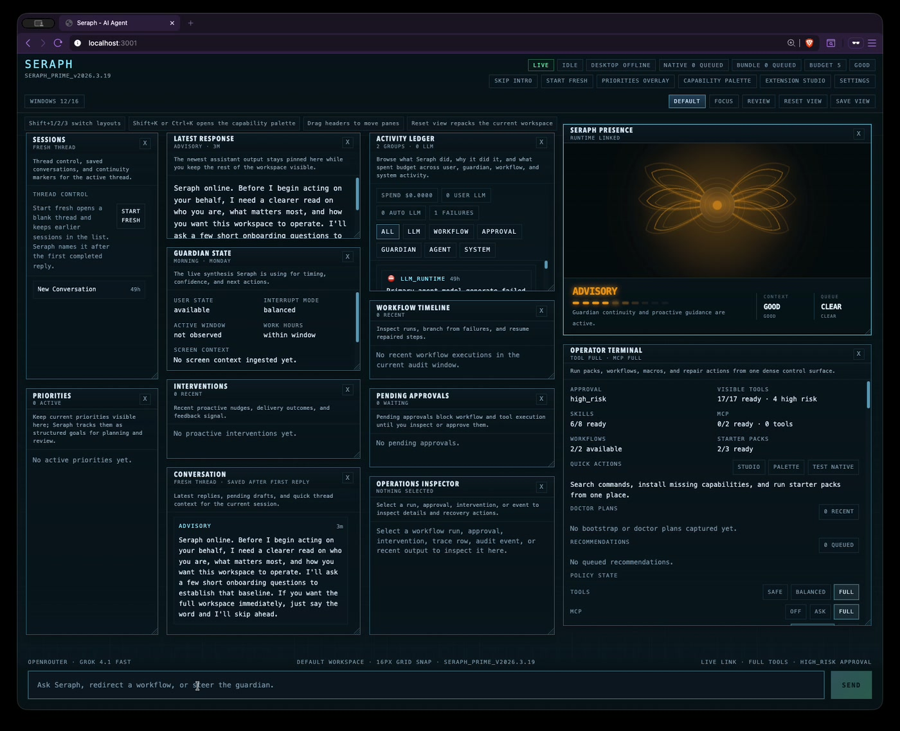

<h1 align="center">Seraph</h1>

<p align="center">
  <strong>A local-first AI guardian workspace for proactive work</strong>
</p>

<p align="center">
  <a href="https://github.com/seraph-quest/seraph/actions"></a>
  
  
  
</p>

<p align="center">
  Seraph is a local guardian prototype for people who want an AI system that can keep state, watch what is happening on the desktop, use tools, run workflows, and proactively surface useful actions instead of waiting for one-off prompts.
</p>

<p align="center">
  <a href="assets/github/seraph-demo.mp4">
    
  </a>
</p>

<p align="center">
  <a href="assets/github/seraph-demo.mp4"><strong>Watch the 20-second workspace demo</strong></a>
</p>

---

## What Seraph Is

Seraph is a workspace-first AI agent with:

- persistent identity and long-term memory
- proactive scheduling, briefings, reviews, and intervention policy
- tool use, reusable workflows, and plug-and-play MCP server integration
- a browser cockpit for live operation and inspection
- an optional macOS daemon for window tracking and OCR-backed screen awareness

This repository is for builders and power users who want to run, inspect, and extend a serious local guardian prototype rather than a chat-only assistant shell.

## Current State

Shipped today on `develop`:

- browser workspace UI, backend APIs, observer daemon, memory, goals, and proactive scheduler foundations
- 17 built-in tool capabilities plus workflow, starter-pack, skill, and MCP integration surfaces
- runtime routing, fallback, approval, audit, and policy foundations
- a dense operator cockpit with activity history, approvals, interventions, and workflow inspection

Still in progress:

- broader native reach beyond the current browser + macOS path
- stronger long-horizon guardian intelligence and intervention learning
- deeper execution hardening and richer extension ergonomics
- a fully complete end-state product; Seraph is usable now, but still under active development

Start with:

- [docs/implementation/STATUS.md](docs/implementation/STATUS.md)
- [docs/implementation/00-master-roadmap.md](docs/implementation/00-master-roadmap.md)
- [docs/research/00-synthesis.md](docs/research/00-synthesis.md)

## Quick Start

### Recommended: Local Direct Dev Stack

```bash
# 1. Configure
cp .env.dev.example .env.dev
# Edit .env.dev and set OPENROUTER_API_KEY=your-key-here

# 2. Launch
./manage.sh -e dev local up

# 3. Open
open http://localhost:3001        # Current shipped browser UI
open http://localhost:8004/docs   # Swagger API docs

# 4. Inspect / stop
./manage.sh -e dev local status
./manage.sh -e dev local logs backend
./manage.sh -e dev local down

# 5. (Optional) Screen awareness daemon
./daemon/run.sh                   # Window tracking
./daemon/run.sh --ocr             # + OCR via Apple Vision
```

`./manage.sh -e dev local up` is the canonical direct browser-development path. It explicitly loads the repo-root `.env.dev`, starts the backend on `8004`, starts the frontend on `3001`, and avoids the cwd-sensitive env drift that can otherwise change the active model/provider.

### Docker Dev Stack

```bash
./manage.sh -e dev up -d
open http://localhost:3000
open http://localhost:8004/docs
```

---

## Architecture

| Layer | Stack |
|-------|-------|
| **Frontend** | React 19, Vite 6, TypeScript, Tailwind CSS, Zustand |
| **Backend** | Python 3.12, FastAPI, uvicorn, smolagents, LiteLLM (OpenRouter) |
| **Database** | SQLite (aiosqlite) + LanceDB (vector memory) |
| **Tools** | 17 built-in tool capabilities (auto-discovered) + reusable workflows + plug-and-play MCP servers |
| **Scheduler** | APScheduler — 9 jobs across briefings, reviews, strategist, observer cleanup, and memory/goal maintenance |
| **Daemon** | Native macOS — window tracking, optional OCR (Apple Vision / OpenRouter) |
| **Infra** | Docker Compose (backend + frontend + snekbox sandbox + http-mcp), uv |

---

## Project Structure

```
frontend/src/
  components/cockpit/ Guardian workspace operator surface, state rails, intervention feed
  components/        React overlays — chat, priorities panel, settings
  hooks/             useWebSocket, keyboard and operator interaction hooks
  stores/            Zustand stores — chat, priorities
  lib/               Tool parser and workspace helpers
  config/            Frontend constants

backend/src/
  api/               REST + WebSocket endpoints (chat, sessions, goals, tools, workflows, mcp)
  agent/             smolagents factory, onboarding, strategist, session manager
  tools/             @tool implementations + MCP manager
  workflows/         Reusable multi-step workflow loader, runtime, and gating
  memory/            Guardian record, LanceDB vector store, embedder, consolidator
  goals/             Hierarchical goal CRUD
  plugins/           Tool auto-discovery + registry
  scheduler/         APScheduler engine, connection manager, 9 background jobs
  observer/          Context manager, data sources, user state machine, delivery engine

daemon/              Native macOS screen daemon (window tracking + OCR)
docs/                Docusaurus docs site
```

---

## Retired Surfaces

The retired village/editor line has been removed from the active repo path. Seraph is being built as a workspace-first guardian system, not a game-shell assistant.

---

## MCP Servers

Add external tool servers with zero code changes:

```bash
./mcp.sh add things3 http://host.docker.internal:9100/mcp \
  --desc "Things3 task manager"

./mcp.sh list              # View configured servers
./mcp.sh test things3      # Test connection
./mcp.sh disable things3   # Toggle without removing
./mcp.sh remove things3    # Remove entirely
```

Also available via the **Settings UI** in the browser or the **REST API** (`/api/mcp/servers`).

Config: `data/mcp-servers.json` | Example: `data/mcp-servers.example.json`

---

## Docker Management

```bash
./manage.sh -e dev up -d       # Start
./manage.sh -e dev down         # Stop
./manage.sh -e dev logs -f      # Tail logs
./manage.sh -e dev build        # Rebuild
```

## Local Direct Runtime

```bash
./manage.sh -e dev local up
./manage.sh -e dev local status
./manage.sh -e dev local logs frontend
./manage.sh -e dev local logs backend
./manage.sh -e dev local down
```

Defaults for the local runtime:

- frontend: `http://localhost:3001`
- backend: `http://localhost:8004`
- workspace dir: `/tmp/seraph-dev-data`
- llm logs: `/tmp/seraph-dev-logs`

Override ports or local paths with env vars before launch if needed:

```bash
LOCAL_FRONTEND_PORT=3100 LOCAL_BACKEND_PORT=8100 ./manage.sh -e dev local up
```

---

## Development Status

Seraph no longer uses the old phase model as the live planning surface.

Canonical docs now live in:

- `docs/implementation/` — shipped state, workstreams, and current status
- `docs/research/` — product thesis and design target

Current truth:

- [x] browser UI, backend APIs, observer daemon, memory, goals, and proactive scheduler foundations are shipped
- [x] Trust Boundaries, Execution Plane, and Runtime Reliability have strong foundations on `develop`
- [x] the source-of-truth docs now target a power-user guardian workspace and the browser app now defaults to that shell
- [ ] no workstream is complete yet
- [ ] Seraph still has substantial work left in presence, guardian intelligence, embodied UX, and ecosystem leverage

Start with:

- [docs/implementation/00-master-roadmap.md](docs/implementation/00-master-roadmap.md)
- [docs/implementation/STATUS.md](docs/implementation/STATUS.md)
- [docs/implementation/08-docs-contract.md](docs/implementation/08-docs-contract.md)
- [docs/implementation/09-benchmark-status.md](docs/implementation/09-benchmark-status.md)
- [docs/implementation/10-superiority-delivery.md](docs/implementation/10-superiority-delivery.md)
- [docs/research/00-synthesis.md](docs/research/00-synthesis.md)
- [docs/research/10-competitive-benchmark.md](docs/research/10-competitive-benchmark.md)
- [docs/research/11-superiority-program.md](docs/research/11-superiority-program.md)

---

## Get Involved

- Read [CONTRIBUTING.md](CONTRIBUTING.md) before opening a PR
- Use [SUPPORT.md](SUPPORT.md) for questions, setup help, and roadmap pointers
- Report security issues through [SECURITY.md](SECURITY.md)
